# Northwind Database Analysis

## Summary

## Overview

## Objectives

---

## Tasks

### **Tasks 1-10**

\
**1. Monthly Spending Rankings**\
**Task:** Identify the top-spending customers each month using rankings.\
**Query:**

```sql
WITH customers_total_spending_per_month AS (
SELECT
customer_id,
TO_CHAR(DATE_TRUNC('month', invoice_date), 'YYYY-MM') AS invoice_month,
SUM(total) AS total_spendings
FROM invoice
GROUP BY customer_id, TO_CHAR(DATE_TRUNC('month', invoice_date), 'YYYY-MM')
ORDER BY invoice_month
)

SELECT *
FROM (
SELECT
customer_id,
CONCAT(first_name, ' ', last_name) AS customer,
invoice_month,
total_spendings,
DENSE_RANK() OVER(PARTITION BY invoice_month ORDER BY total_spendings DESC) AS monthly_customer_rank
FROM customers_total_spending_per_month
JOIN customer
USING(customer_id))
WHERE monthly_customer_rank BETWEEN 1 AND 3;
```
**Results:**
|   customer_id | customer           | invoice_month   |   total_spendings |   monthly_customer_rank |
|--------------:|:-------------------|:----------------|------------------:|------------------------:|
|            23 | John Gordon        | 2021-01         |             13.86 |                       1 |
|            14 | Mark Philips       | 2021-01         |              8.91 |                       2 |
|             8 | Daan Peeters       | 2021-01         |              5.94 |                       3 |
|             2 | Leonie Köhler      | 2021-02         |             13.86 |                       1 |
|            52 | Emma Jones         | 2021-02         |              8.91 |                       2 |
|            46 | Hugh O'Reilly      | 2021-02         |              5.94 |                       3 |
|            40 | Dominique Lefebvre | 2021-03         |             13.86 |                       1 |
|            31 | Martha Silk        | 2021-03         |              8.91 |                       2 |
|            25 | Victor Stevens     | 2021-03         |              5.94 |                       3 |

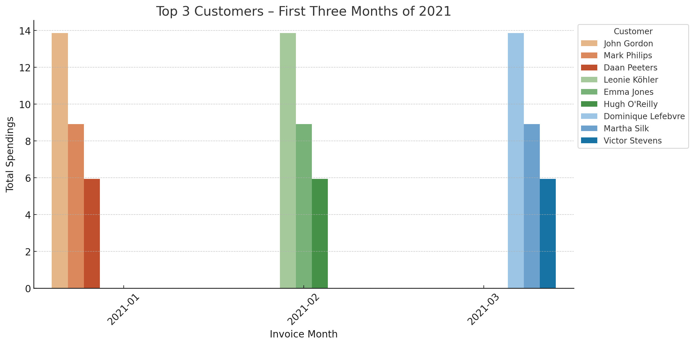
*Bar graph visualizing the top-spending customers each month using rankings; ChatGPT generated this graph from SQL query results.*

**2. Sales Trends Analysis**

**Task:** Track monthly sales and compare trends over time.

**Query:**

```sql
WITH total_spending_per_month AS (
SELECT
TO_CHAR(DATE_TRUNC('month', invoice_date), 'YYYY-MM') AS month,
SUM(Total) AS total_spendings
FROM invoice
GROUP BY TO_CHAR(DATE_TRUNC('month', invoice_date), 'YYYY-MM')
ORDER BY TO_CHAR(DATE_TRUNC('month', invoice_date), 'YYYY-MM')
)

SELECT
month,
total_spendings,
total_spendings - LAG(total_spendings) OVER(ORDER BY month) AS prev_month_spending_diff
FROM total_spending_per_month
ORDER BY month;
```
**Results:**

| month   |   total_spendings |   prev_month_spending_diff |
|:--------|------------------:|---------------------------:|
| 2021-12 |             37.62 |                          0 |
| 2022-01 |             52.62 |                         15 |
| 2022-02 |             46.62 |                         -6 |
| 2022-03 |             44.62 |                         -2 |
| 2022-04 |             37.62 |                         -7 |
| 2022-05 |             37.62 |                          0 |

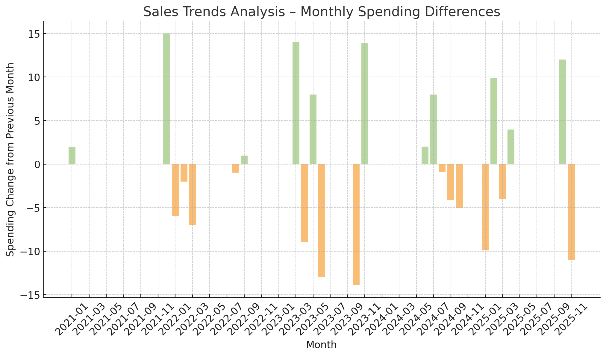
*Bar graph visualizing the sales trends analysis - monthly spedning differences; ChatGPT generated this graph from SQL query results.*

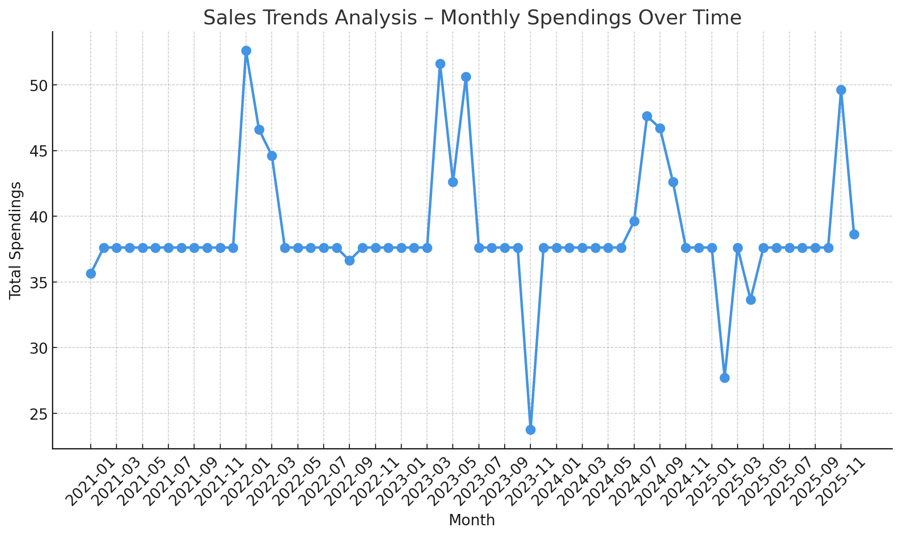
*Line graph visualizing the sales trends analysis - monthly spedning over time; ChatGPT generated this graph from SQL query results.*

**3. Longest Gaps Between Purchases**

**Task:** Find the longest time gaps between customer purchases.

**Query:**

```sql
SELECT *
FROM (
SELECT
customer_id,
CONCAT(first_name, ' ', last_name) AS customer_name,
invoice_date,
LAG(invoice_date) OVER(PARTITION BY customer_id ORDER BY invoice_date) AS previous_invoice_date,
invoice_date - LAG(invoice_date) OVER(PARTITION BY customer_id ORDER BY invoice_date) AS time_diff_from_last_invoice
FROM invoice
JOIN customer
USING(customer_id)
ORDER BY time_diff_from_last_invoice DESC)
WHERE previous_invoice_date IS NOT NULL;
```
**Results:**

| customer_id | customer_name         | invoice_date       | previous_invoice_date | time_diff_from_last_invoice |
|------------|----------------------|--------------------|----------------------|----------------------------|
| 48         | Johannes Van der Berg | 2022-12-15        | 2021-05-10           | {"days": 584}              |
| 45         | Ladislav Kovács       | 2024-05-25        | 2022-10-19           | {"days": 584}              |
| 4          | Bjørn Hansen          | 2025-10-03        | 2024-02-27           | {"days": 584}              |
| 12         | Roberto Almeida       | 2025-03-31        | 2023-08-25           | {"days": 584}              |
| 3          | François Tremblay     | 2024-07-26        | 2022-12-20           | {"days": 584}              |

**4. Track Title Lengths and Sales**

**Task:** Analyze the relationship between track title lengths and sales.

**Query:**

```sql
WITH track_total_sale AS (
SELECT
track_id,
SUM(quantity) AS total_sale
FROM invoice_line
GROUP BY track_id
), track_title_lengths AS(
SELECT
track_id,
name,
CASE
WHEN LENGTH(name) <= 10 THEN 'very short'
WHEN LENGTH(name) <= 30 THEN 'short'
WHEN LENGTH(name) <= 60 THEN 'medium'
WHEN LENGTH(name) <= 100 THEN 'long'
ELSE 'very long'
END AS title_length
FROM track
)

SELECT
title_length,
ROUND(AVG(total_sale), 3) AS average_sale
FROM track_total_sale
JOIN track_title_lengths
USING(track_id)
GROUP BY title_length
ORDER BY average_sale DESC;
```
**Results:**
| Title Length  | Average Sale |
|--------------|--------------|
| Long         | 1.200        |
| Short        | 1.131        |
| Medium       | 1.125        |
| Very Short   | 1.125        |
| Very Long    | 1.000        |

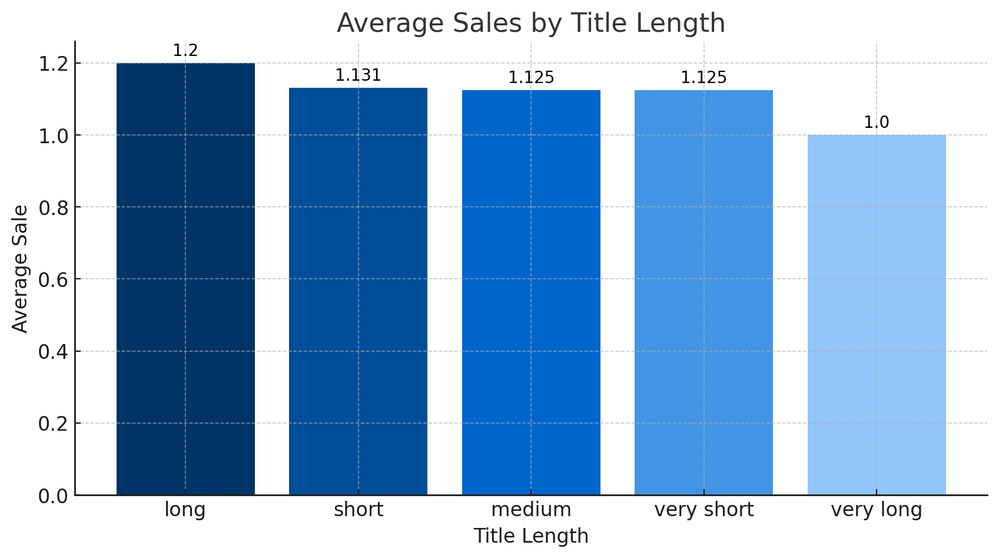
*Bar graph visualizing the relationship between track title lengths and sales; ChatGPT generated this graph from SQL query results.*

**5. Keyword Analysis in Track Titles**

**Task:** Identify the most common words in track titles and their sales impact.
**Query:**

```sql
WITH top_track_words AS (
SELECT
words_in_tracks,
COUNT(words_in_tracks) AS words_counted
FROM (
SELECT
REGEXP_REPLACE(LOWER(REGEXP_SPLIT_TO_TABLE(name, ' |/')), '[^a-zA-Z0-9 ]', '', 'g') AS words_in_tracks
FROM track
) AS split
-- deleting stop words without semantic value
WHERE words_in_tracks NOT IN ('', 'the', 'of', 'a', 'in', 'to', 'no', 'on', 'do', 'de', 'and', 'for', 'o', 'it', 'da', 'is', 'be', 'all', '2', 'e', 'pt', 'from', 'with')
GROUP BY words_in_tracks
HAVING COUNT(words_in_tracks) >= 25
ORDER BY words_counted DESC
)

SELECT
words_in_tracks,
words_counted,
COUNT(DISTINCT(track_id)) AS unique_track_count,
SUM(quantity) AS total_sale
FROM top_track_words
JOIN track
ON track.name ILIKE CONCAT('%', words_in_tracks, '%')
JOIN invoice_line
USING(track_id)
GROUP BY words_in_tracks, words_counted
ORDER BY unique_track_count DESC;
```
**Results:**

| Word  | Words Counted | Unique Track Count | Total Sale |
|-------|--------------|--------------------|------------|
| You   | 129          | 80                 | 82         |
| I     | 111          | 66                 | 73         |
| Love  | 103          | 59                 | 69         |
| Me    | 88           | 52                 | 58         |
| My    | 68           | 33                 | 35         |

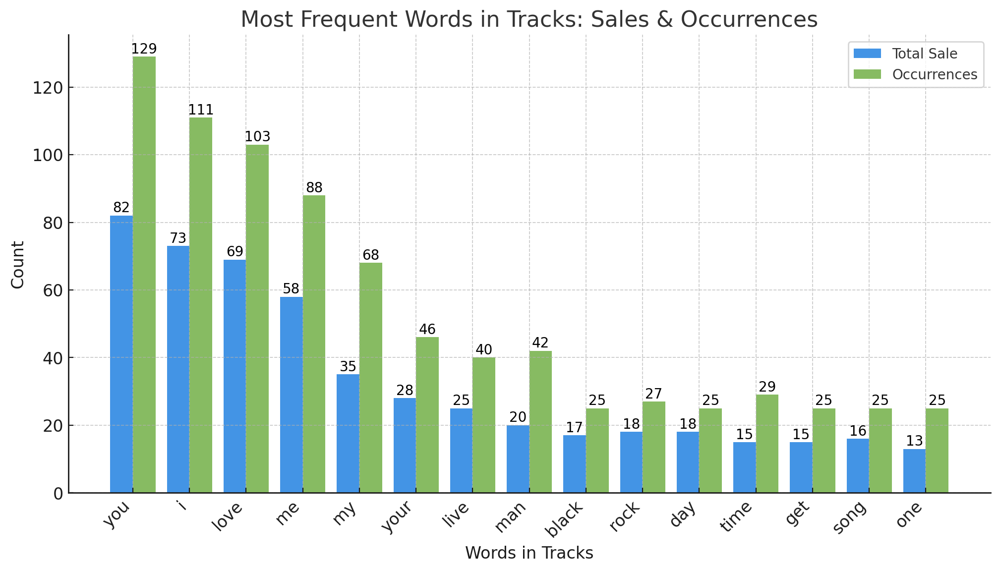
*Bar graph visualizing the most frequent words in tracks: sales and occurrences; ChatGPT generated this graph from SQL query results.*

**6. Highest Average Invoice Value**

**Task:** Rank customers by their average invoice value.

**Query:**

```sql
SELECT
customer_id,
CONCAT(first_name, ' ', last_name) AS customer_name,
ROUND(AVG(total), 2) AS average_invoice_value
FROM invoice
JOIN customer
USING(customer_id)
GROUP BY customer_id, customer_name
ORDER BY average_invoice_value DESC;
```
**Results:**

| Customer ID | Customer               | Average Invoice Value | Customer Rank |
|------------|------------------------|-----------------------|--------------|
| 6          | Helena Holý            | 7.089                 | 1            |
| 26         | Richard Cunningham     | 6.803                 | 2            |
| 57         | Luis Rojas             | 6.660                 | 3            |
| 45         | Ladislav Kovács        | 6.517                 | 4            |
| 46         | Hugh O'Reilly          | 6.517                 | 4            |
| 28         | Julia Barnett          | 6.231                 | 5            |
| 37         | Fynn Zimmermann        | 6.231                 | 5            |
| 24         | Frank Ralston          | 6.231                 | 5            |

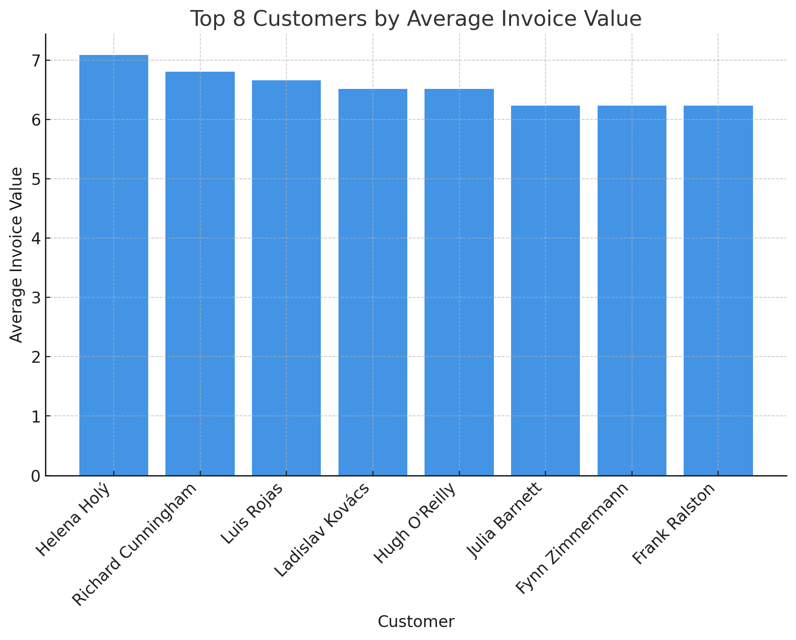
*Bar graph visualizing customers with highest average invoice value; ChatGPT generated this graph from SQL query results.*

**7. Seasonality of Sales**

**Task:** Analyze monthly sales distribution and seasonal patterns.

**Query:**

```sql
SELECT
EXTRACT(MONTH FROM invoice_date) AS month,
SUM(total) AS monthly_sales
FROM invoice
GROUP BY month
ORDER BY monthly_sales DESC;
```
**Resutls:**

| Invoice Date | Total Monthly Sales | Percentage of Total Sales |
|-------------|---------------------|--------------------------|
| 2021-01     | 35.64               | 1.531%                   |
| 2021-02     | 37.62               | 1.616%                   |
| 2021-03     | 37.62               | 1.616%                   |
| 2021-04     | 37.62               | 1.616%                   |
| 2021-05     | 37.62               | 1.616%                   |

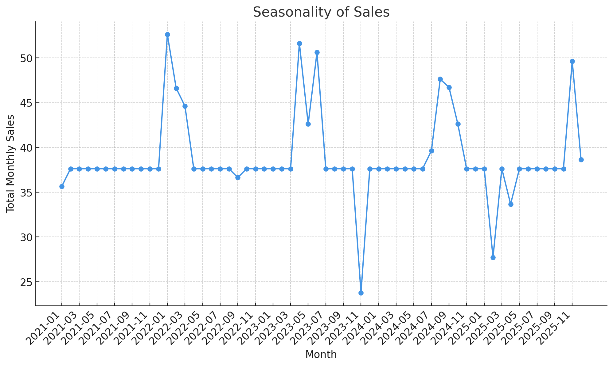
*Line graph visualizing seasonality of sales; ChatGPT generated this graph from SQL query results.*

**8. Category Sales Contribution**

**Task:** Calculate each category’s percentage contribution to total sales.

**Query:**

```sql
SELECT
c.name AS category_name,
ROUND(SUM(il.unit_price * il.quantity), 2) AS total_sales,
ROUND(SUM(il.unit_price * il.quantity) * 100 / (SELECT SUM(unit_price * quantity) FROM invoice_line), 2) AS percentage_contribution
FROM invoice_line il
JOIN track t ON il.track_id = t.track_id
JOIN album a ON t.album_id = a.album_id
JOIN genre g ON t.genre_id = g.genre_id
JOIN category c ON g.category_id = c.category_id
GROUP BY category_name
ORDER BY total_sales DESC;
```
**Results:**

| Category Name         | Sales Value | Percentage of Total Sales |
|----------------------|------------|---------------------------|
| Rock                | 826.65     | 35.50%                    |
| Latin               | 382.14     | 16.41%                    |
| Metal               | 261.36     | 11.22%                    |
| Alternative & Punk  | 241.56     | 10.37%                    |
| TV Shows           | 93.53      | 4.02%                     |

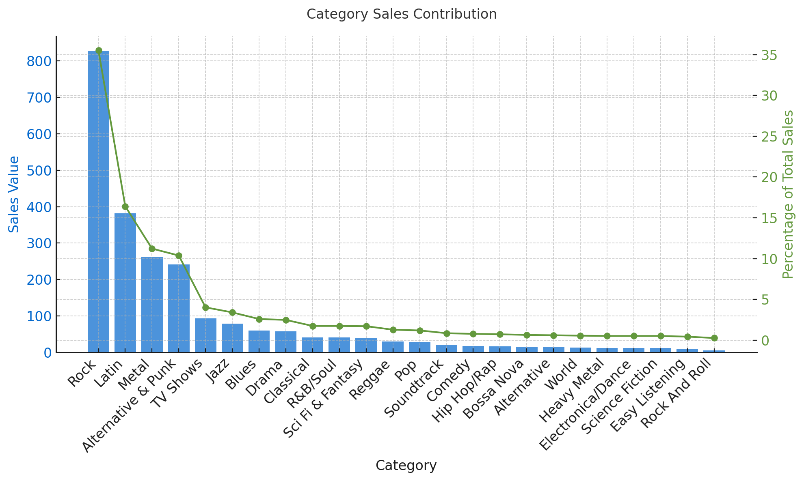
*Bar and line graph visualizing sales and percentage of total sales per category; ChatGPT generated this graph from SQL query results.*

**9. Customer Spending Declines**

**Task:** Identify customers whose monthly spending has decreased over time.
**Query:**

```sql
WITH monthly_spending AS (
SELECT
customer_id,
TO_CHAR(invoice_date, 'YYYY-MM') AS month,
SUM(total) AS total_spending
FROM invoice
GROUP BY customer_id, month
)
SELECT
customer_id,
month,
total_spending,
total_spending - LAG(total_spending) OVER (PARTITION BY customer_id ORDER BY month) AS spending_change
FROM monthly_spending
ORDER BY spending_change ASC;
```
**Results:**
| Customer ID | Customer Name         | Invoice Month | Monthly Spending | Previous Invoice Month | Previous Monthly Spending | Spending Decline |
|------------|-----------------------|--------------|------------------|------------------------|--------------------------|------------------|
| 57         | Luis Rojas             | 2023-08      | 1.98             | 2022-01                | 17.91                     | -15.93           |
| 26         | Richard Cunningham     | 2025-04      | 8.91             | 2024-08                | 23.86                     | -14.95           |
| 45         | Ladislav Kovács        | 2022-10      | 8.91             | 2022-02                | 21.86                     | -12.95           |
| 46         | Hugh O'Reilly          | 2023-12      | 8.91             | 2023-04                | 21.86                     | -12.95           |
| 37         | Fynn Zimmermann        | 2024-11      | 1.98             | 2023-04                | 14.91                     | -12.93           |

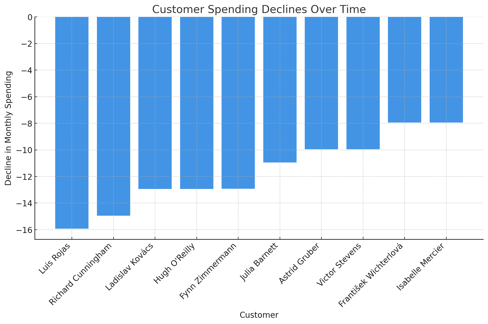
*Bar graph visualizing the customer spending declines; ChatGPT generated this graph from SQL query results.*

**10. Track Length vs. Sales**

**Task:** Evaluate the correlation between track length and sales.

**Query:**

```sql
SELECT
CASE
WHEN milliseconds < 180000 THEN 'Short (<3 min)'
WHEN milliseconds BETWEEN 180000 AND 300000 THEN 'Medium (3-5 min)'
ELSE 'Long (>5 min)'
END AS track_length_category,
ROUND(AVG(il.unit_price * il.quantity), 2) AS avg_sales
FROM track t
JOIN invoice_line il ON t.track_id = il.track_id
GROUP BY track_length_category
ORDER BY avg_sales DESC;
```
**Results:**
| Track Length & Sale Coreelation  | 
|------------|
| 0.9335378478105226         |
---

### **Tasks 11-20**

**11. Rarest Customers**

**Task:** Identify customers who have made the fewest purchases.

**Query:**

```sql
SELECT
customer_id,
CONCAT(first_name, ' ', last_name) AS customer_name,
COUNT(invoice_id) AS total_purchases
FROM invoice
JOIN customer USING(customer_id)
GROUP BY customer_id, customer_name
ORDER BY total_purchases ASC
LIMIT 10;
```
**Results:**
| Customer ID | Least Frequent Customer | Number of Purchases |
|-------------|-------------------------|---------------------|
| 59          | Puja Srivastava          | 6                   |


**12. Best-Selling Albums**

**Task:** Determine the top revenue-generating albums.

**Query:**

```sql
SELECT
album_id,
a.title AS album_title,
SUM(il.unit_price * il.quantity) AS total_sales
FROM invoice_line il
JOIN track t ON il.track_id = t.track_id
JOIN album a ON t.album_id = a.album_id
GROUP BY album_id, album_title
ORDER BY total_sales DESC
LIMIT 10;
```
**Results:**
| Album ID | Total Album Revenue |
|----------|---------------------|
| 253      | 35.82               |
| 251      | 31.84               |
| 23       | 26.73               |
| 231      | 25.87               |
| 228      | 25.87               |
| 141      | 25.74               |
| 73       | 24.75               |
| 227      | 23.88               |
| 229      | 21.89               |
| 224      | 21.78               |


**13. Purchase Patterns by Weekday**

**Task:** Analyze the distribution of purchases by day of the week.

**Query:**

```sql
SELECT
TO_CHAR(invoice_date, 'Day') AS day_of_week,
COUNT(*) AS total_purchases
FROM invoice
GROUP BY day_of_week
ORDER BY total_purchases DESC;
```
**Results:**
| Invoice Day | Invoice Percentage |
|-------------|--------------------|
| Monday      | 14.56              |
| Thursday    | 14.32              |
| Tuesday     | 14.32              |
| Saturday    | 14.32              |
| Friday      | 14.32              |
| Wednesday   | 14.08              |
| Sunday      | 14.08              |

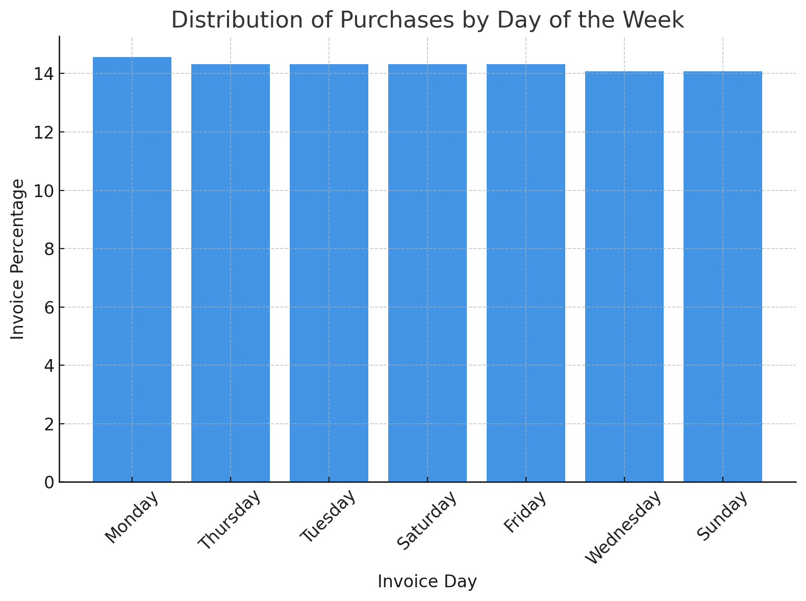
*Bar graph visualizing the distribution of purchases by day of the week; ChatGPT generated this graph from SQL query results.*

**14. Most Active Customers**

**Task:** Find customers who purchased the most tracks.

**Query:**

```sql
SELECT
customer_id,
CONCAT(first_name, ' ', last_name) AS customer_name,
COUNT(il.invoice_id) AS total_purchases
FROM invoice_line il
JOIN invoice i USING(invoice_id)
JOIN customer c USING(customer_id)
GROUP BY customer_id, customer_name
ORDER BY total_purchases DESC
LIMIT 10;
```
**Results:**
| Customer ID | Customer Name      | Total Number of Tracks | Customer Rank |
|-------------|--------------------|------------------------|---------------|
| 30          | Edward Francis     | 38                     | 1             |
| 34          | João Fernandes     | 38                     | 1             |
| 19          | Tim Goyer          | 38                     | 1             |
| 26          | Richard Cunningham | 38                     | 1             |
| 37          | Fynn Zimmermann    | 38                     | 1             |
| 55          | Mark Taylor        | 38                     | 1             |
| 46          | Hugh O'Reilly      | 38                     | 1             |
| 13          | Fernanda Ramos     | 38                     | 1             |
| 24          | Frank Ralston      | 38                     | 1             |
| 49          | Stanisław Wójcik   | 38                     | 1             |

**15. Track Length Frequency**

**Task:** Group tracks by length ranges and analyze their occurrence.

**Query:**

```sql
SELECT
CASE
WHEN milliseconds < 180000 THEN 'Short (<3 min)'
WHEN milliseconds BETWEEN 180000 AND 300000 THEN 'Medium (3-5 min)'
ELSE 'Long (>5 min)'
END AS track_length_category,
COUNT(*) AS track_count
FROM track
GROUP BY track_length_category
ORDER BY track_count DESC;
```
**Results:**
| Length Category                | Number of Tracks | Percentage of Total |
|---------------------------------|------------------|---------------------|
| Over 5 minutes                 | 1069             | 30.52               |
| Between 3 and 4 minutes        | 982              | 28.03               |
| Between 4 and 5 minutes        | 972              | 27.75               |
| Between 2 and 3 minutes        | 387              | 11.05               |
| Between 1 and 2 minutes        | 66               | 1.88                |
| Less than 1 minute             | 27               | 0.77                |

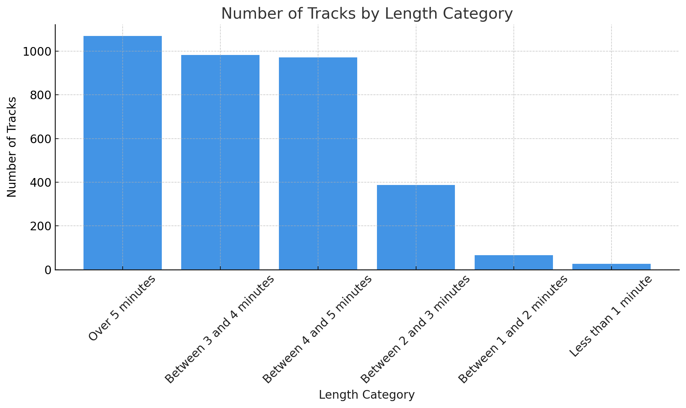
*Bar graph visualizing the number of tracks by length category; ChatGPT generated this graph from SQL query results.*

**16. Top-Selling Genres**

**Task:** Identify the genres that generate the highest sales.

**Query:**

```sql
SELECT
g.name AS genre,
SUM(il.unit_price * il.quantity) AS total_sales
FROM invoice_line il
JOIN track t ON il.track_id = t.track_id
JOIN genre g ON t.genre_id = g.genre_id
GROUP BY genre
ORDER BY total_sales DESC
LIMIT 10;
```
**Results:**
| Genre ID | Genre Name        | Number of Tracks Sold | Percentage of Market |
|----------|-------------------|-----------------------|----------------------|
| 1        | Rock              | 835                   | 37.28                |
| 7        | Latin             | 386                   | 17.23                |
| 3        | Metal             | 264                   | 11.79                |
| 4        | Alternative & Punk | 244                   | 10.89                |
| 2        | Jazz              | 80                    | 3.57                 |
| 6        | Blues             | 61                    | 2.72                 |
| 19       | TV Shows          | 47                    | 2.10                 |
| 24       | Classical         | 41                    | 1.83                 |
| 14       | R&B/Soul          | 41                    | 1.83                 |
| 8        | Reggae            | 30                    | 1.34                 |

**17. Order Value Analysis by Country**

**Task:** Analyze the average order value across different countries to identify high-spending regions and their contribution to total revenue.

**Query:**

```sql
SELECT
billing_country,
ROUND(AVG(total), 2) AS avg_order_value,
SUM(total) AS total_sales
FROM invoice
GROUP BY billing_country
ORDER BY total_sales DESC;
```
**Results:**
| Billing Country | Average Total Sale | Number of Invoices | Total Sale | Total Sale Percentage of Market |
|-----------------|--------------------|--------------------|------------|----------------------------------|
| India           | 5.79               | 13                 | 75.26      | 3.23                             |
| Finland         | 5.95               | 7                  | 41.62      | 1.79                             |
| Portugal        | 5.52               | 14                 | 77.24      | 3.32                             |
| United Kingdom  | 5.37               | 21                 | 112.86     | 4.85                             |
| Argentina       | 5.37               | 7                  | 37.62      | 1.62                             |
| Australia       | 5.37               | 7                  | 37.62      | 1.62                             |
| Canada          | 5.43               | 56                 | 303.96     | 13.05                            |
| Italy           | 5.37               | 7                  | 37.62      | 1.62                             |
| Ireland         | 6.52               | 7                  | 45.62      | 1.96                             |
| Chile           | 6.66               | 7                  | 46.62      | 2.00                             |


**18. Analysis of Sales Growth Dynamics by Country**

**Task:** Analyze the annual sales growth dynamics by country, including total sales, year-over-year percentage change, and country ranking based on growth trends.

**Query:**

```sql
WITH yearly_sales AS (
SELECT
billing_country,
EXTRACT(YEAR FROM invoice_date) AS year,
SUM(total) AS total_sales
FROM invoice
GROUP BY billing_country, year
)
SELECT
billing_country,
year,
total_sales,
total_sales - LAG(total_sales) OVER(PARTITION BY billing_country ORDER BY year) AS sales_change
FROM yearly_sales
ORDER BY billing_country, year;
```
**Results:**
| Billing Country    | Year | Total Sale | Total Sale Previous Year | Sales Growth |
|--------------------|------|------------|--------------------------|--------------|
| Australia          | 2024 | 22.77      | 1.98                     | 1050.0%      |
| Portugal          | 2024 | 24.77      | 8.91                     | 178.0%       |
| Brazil            | 2024 | 53.46      | 19.80                    | 170.0%       |
| Czech Republic    | 2024 | 19.83      | 12.87                    | 54.1%        |
| USA               | 2024 | 127.98     | 103.01                   | 24.2%        |
| Chile             | 2024 | 6.93       | 5.94                     | 16.7%        |
| France            | 2024 | 36.66      | 42.61                    | -14.0%       |
| Canada            | 2024 | 42.57      | 55.44                    | -23.2%       |
| United Kingdom    | 2024 | 9.90       | 17.82                    | -44.4%       |
| Norway            | 2024 | 8.91       | 17.84                    | -50.1%       |
| India             | 2024 | 10.89      | 24.75                    | -56.0%       |
| Germany           | 2024 | 18.81      | 48.57                    | -61.3%       |
| Netherlands       | 2024 | 0.99       | 12.90                    | -92.3%       |
| Finland           | 2024 | 0.99       | 15.88                    | -93.8%       |

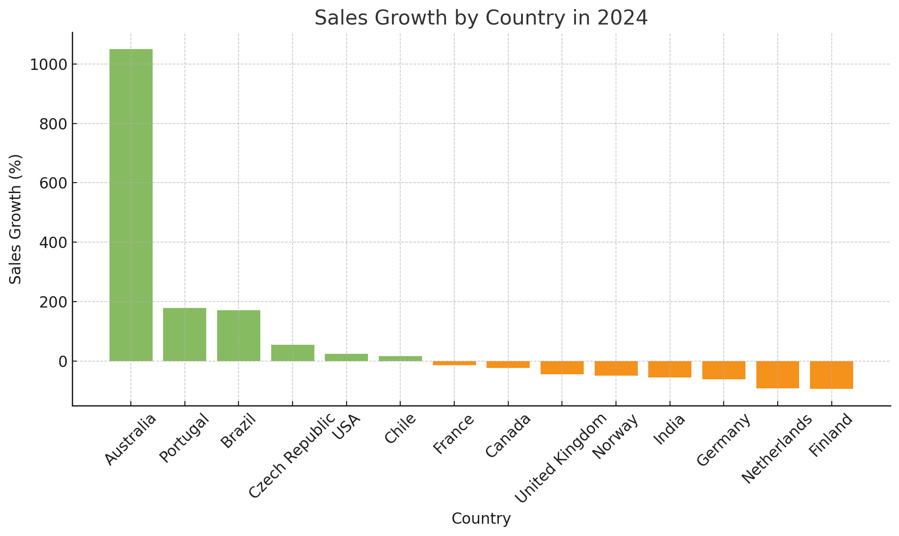
*Bar graph visualizing sales growth by country in 2024; ChatGPT generated this graph from SQL query results.*

**19. Customer Retention Analysis**

**Task:** Evaluate customer retention based on purchase frequency.

**Query:**

```sql
SELECT 
  customer_id,
  CONCAT(first_name, ' ', last_name) AS customer_name,
  MIN(invoice_date) AS first_invoice,
  MAX(invoice_date) AS last_invoice,
  MAX(invoice_date) - MIN(invoice_date) AS time_between_first_and_last_invoice,
  COUNT(invoice_id) AS number_of_invoices
FROM invoice
JOIN customer
USING(customer_id)
GROUP BY customer_id, first_name, last_name
```
**Results:**
| Customer ID | Customer Name     | First Invoice          | Last Invoice           | Time Between Invoices (Days) | Number of Invoices |
|-------------|-------------------|------------------------|------------------------|-----------------------------|--------------------|
| 16          | Frank Harris      | 2021-02-19 00:00:00    | 2025-07-04 00:00:00    | 1596                        | 7                  |
| 18          | Michelle Brooks   | 2022-05-12 00:00:00    | 2025-10-08 00:00:00    | 1245                        | 7                  |
| 34          | João Fernandes    | 2021-05-05 00:00:00    | 2024-10-01 00:00:00    | 1245                        | 7                  |
| 17          | Jack Smith        | 2021-03-04 00:00:00    | 2024-07-31 00:00:00    | 1245                        | 7                  |
| 50          | Enrique Muñoz     | 2021-06-23 00:00:00    | 2025-11-05 00:00:00    | 1596                        | 7                  |
| 19          | Tim Goyer         | 2021-03-04 00:00:00    | 2024-09-13 00:00:00    | 1289                        | 7                  |
| 6           | Helena Holý       | 2021-07-11 00:00:00    | 2025-11-13 00:00:00    | 1586                        | 7                  |
| 26          | Richard Cunningham| 2021-11-07 00:00:00    | 2025-04-05 00:00:00    | 1245                        | 7                  |
| 36          | Hannah Schneider  | 2021-05-05 00:00:00    | 2024-11-14 00:00:00    | 1289                        | 7                  |
| 3           | François Tremblay | 2022-03-11 00:00:00    | 2025-09-20 00:00:00    | 1289                        | 7                  |


**20. Analysis of Average Time Between Customer Purchases**

**Task:** Analyze the average number of days between consecutive purchases for each customer to identify the most frequent buyers and assess customer loyalty.

**Query:**

```sql
WITH purchase_intervals AS (
SELECT
customer_id,
invoice_date,
LAG(invoice_date) OVER (PARTITION BY customer_id ORDER BY invoice_date) AS previous_purchase_date
FROM invoice
)
SELECT
customer_id,
ROUND(AVG(invoice_date - previous_purchase_date), 2) AS avg_days_between_purchases
FROM purchase_intervals
WHERE previous_purchase_date IS NOT NULL
GROUP BY customer_id
ORDER BY avg_days_between_purchases ASC;
```
**Results:**
| Customer ID | Customer Name        | Average Time Between Purchases (Days) | Customer Rank Average Time | Number of Invoices |
|-------------|----------------------|---------------------------------------|----------------------------|--------------------|
| 1           | Luís Gonçalves       | 207                                   | 1                          | 6                  |
| 34          | João Fernandes       | 207                                   | 1                          | 6                  |
| 18          | Michelle Brooks      | 207                                   | 1                          | 6                  |
| 17          | Jack Smith           | 207                                   | 1                          | 6                  |
| 26          | Richard Cunningham   | 207                                   | 1                          | 6                  |
| 5           | František Wichterlová| 207                                   | 1                          | 6                  |
| 55          | Mark Taylor          | 207                                   | 1                          | 6                  |
| 39          | Camille Bernard      | 207                                   | 1                          | 6                  |
| 13          | Fernanda Ramos       | 207                                   | 1                          | 6                  |
| 47          | Lucas Mancini        | 207                                   | 1                          | 6                  |

---

## What I Learned

---

## Conclusions

